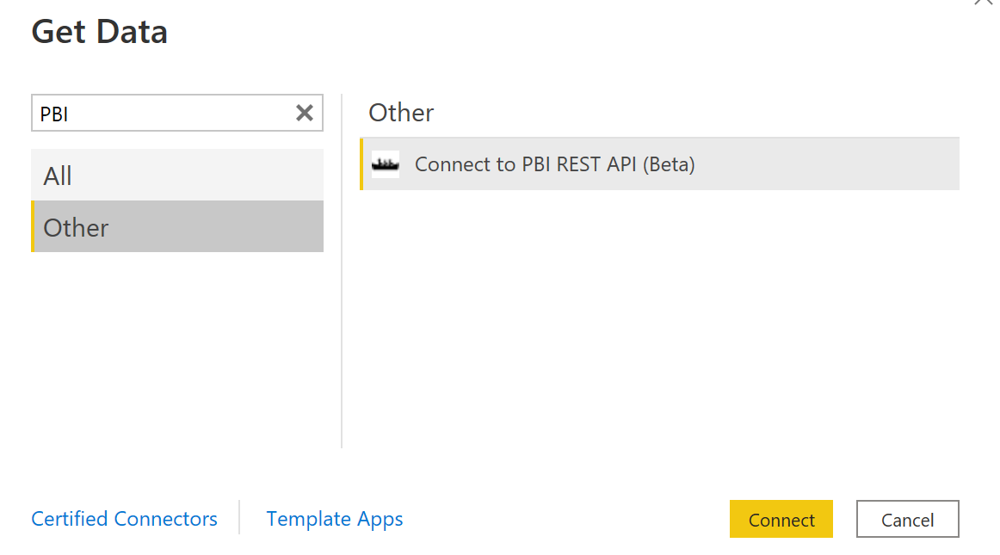
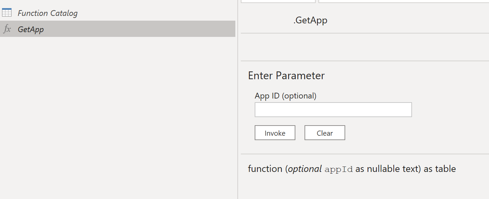
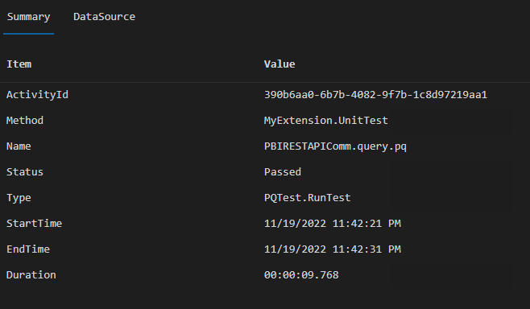

# Power Query Custom Data Connector for Power BI REST APIs (Commercial)

This Custom Data Connector wraps many of the "Get" endpoints in the Power BI API (with the exception of the /executeQueries endpoint), so that OAuth can be used to authenticate to the service.  This connector serves as a way to have a library of Power Query functions to build datasets based on the Power BI APIs without the need for storing client secrets or passwords in the dataset.  

Each function returns a JSON body and not a table of data.  This decision was made to provide flexibility in converting the JSON body to tabular data when 1) the API responses are changed by Microsoft or 2) the API responses differ between commercial and sovereign clouds (e.g., GCC, DoD, etc.). 

## Table of Contents

1. [Installation](#installation)
    1. [Desktop](#desktop)
    1. [Using Functions](#using-functions)
    1. [Functions Implemented](#functions-implemented)
    1. [On-Premises Gateway](#on-premises-gateway)
1. [Building Connector](#building-connector)
    1. [Testing Connector](#testing-connector)

## Installation

### Desktop
1. Open Power BI Desktop and navigate to File -> Options and Settings -> Options.
2. Navigate to GLOBAL -> Security and under "Data Extensions" choose "Allow any extension..."

Because this is a custom data connector you have to choose this option in order to use it in Power BI Desktop.

3. Close all Power BI Desktop instances on your local machine.  You are often prompted to do so by Power BI Desktop.
4. Copy the [.mez file](https://github.com/kerski/powerquery-connector-pbi-rest-api-commercial/blob/main/bin/AnyCPU/Debug/powerquery-connector-pbi-rest-api-commercial.mez?raw=true) to your folder "Documents\Power BI Desktop\Custom Connectors".  If the folder does not exist create it first.
5. Open Power BI Desktop
6. Select Get Data option.
7. Navigate to the "Other" section and you should see the "PBIRESTAPIComm" connector.

8. Select the connector and press the "Connect" button.
9. You may be prompted with the pop-up below. Choose "Continue".

10. If this is your first time using the custom data connector you will be prompted to sign into Office 365. Please follow the instructions to sign in and then choose the "Connect" button.

10. The Navigator prompt will appear (example below).

11. Choose the "GetApps" option and you should see a json response (see example below)

12. Then choose the "Transform Data" button.  This should open the Power Query Editor.

13. Under "Applied Steps", remove the steps "Invoked FunctionGetApps1" and "Navigation".

14. You now will see a catalog of the Power BI REST APIs to leverage.  I suggest you rename the Query "GetApps" to "Function Catalog"

15. I suggest you also uncheck "Enable Load" for the Function Catalog so it doesn't appear in the data model. When disabled the Function Catalog will appear italicized.

### Using Functions

With the Function Catalog created, please follow these steps to leverage the functions:

1. Identify the name of the function you wish to use. Right-click on the "Function" value located for the appropriate row and select "Add as New Query".

2. The function will be created and it can now be used to query the Power BI service.

### Functions Implemented

Not all functions from the Power BI REST API has been implemented.  Here are the endpoints availabe at the moment.

| End Point                      | Description  | MSDN Documentation |
|:-----------------------------|:-------------|:------------------|
| GetApp                        | Returns the specified installed app.  | [Apps -Get App](https://learn.microsoft.com/en-us/rest/api/power-bi/apps/get-app) |
| GetApps                       | Returns a list of installed apps.  | [Apps -Get Apps](https://learn.microsoft.com/en-us/rest/api/power-bi/apps/get-apps) |
| GetDashboardInApp             | Returns the specified dashboard from the specified app.  | [Apps - Get Dashboard](https://learn.microsoft.com/en-us/rest/api/power-bi/apps/get-dashboard) |
| GetDashboardsInApp            | Returns a list of dashboards from the specified app.  | [Apps - Get Dashboards](https://learn.microsoft.com/en-us/rest/api/power-bi/apps/get-dashboards) |
| GetReportInApp                | Returns the specified report from the specified app.  | [Apps - Get Reports](https://learn.microsoft.com/en-us/rest/api/power-bi/apps/get-report) |
| GetReportsInApp               | Returns a list of reports from the specified app.  | [Apps - Get Reports](https://learn.microsoft.com/en-us/rest/api/power-bi/apps/get-reports) |
| GetDatasetInGroup             | Returns the specified dataset from the specified workspace.  | [Datasets - Get Dataset In Group](https://learn.microsoft.com/en-us/rest/api/power-bi/datasets/get-dataset-in-group) |
| GetDatasetRefreshHistoryInGroup| Returns the refresh history for the specified dataset from the specified workspace.  | [Datasets - Get Refresh History](https://learn.microsoft.com/en-us/rest/api/power-bi/datasets/get-refresh-history-in-group) |
| GetDatasetRefreshScheduleInGroup|      Description  | [Datasets - Get Refresh Schedule In Group](https://learn.microsoft.com/en-us/rest/api/power-bi/datasets/get-refresh-schedule-in-group) |
| ExecuteQuery                  | Executes a single Data Analysis Expressions (DAX) query against a dataset  | [Dataset - Execute Queries](https://learn.microsoft.com/en-us/rest/api/power-bi/datasets/execute-queries) |
| ExecuteQueryInGroup                 | Executes a single Data Analysis Expressions (DAX) query against a dataset within a workspace | [Dataset - Execute Queries In Group](https://learn.microsoft.com/en-us/rest/api/power-bi/datasets/execute-queries-in-group) |
| GetPageInGroup         | Returns the specified page within the specified report from the specified workspace.  | [Reports - Get Page In Group](https://learn.microsoft.com/en-us/rest/api/power-bi/reports/get-page-in-group) |
| GetPagesInGroup          | Returns a list of pages within the specified report from the specified workspace.  | [Reports - Get Pages In Group](https://learn.microsoft.com/en-us/rest/api/power-bi/reports/get-pages-in-group) |
| GetReportInGroup          | Returns the specified report from the specified workspace.  | [Reports - Get Report In Group](https://learn.microsoft.com/en-us/rest/api/power-bi/reports/get-report-in-group) |
| GetReportsInGroup         | Returns a list of reports from the specified workspace.  | [Reports - Get Reports In Group](https://learn.microsoft.com/en-us/rest/api/power-bi/reports/get-reports-in-group) |
| GetGroupUsers                 | Returns a list of users that have access to the specified workspace.  | [Groups - Get Group Users](https://learn.microsoft.com/en-us/rest/api/power-bi/groups/get-group-users) |
| GetGroups                     | Returns a list of workspaces the user has access to.  | [Groups - Get Groups](https://learn.microsoft.com/en-us/rest/api/power-bi/groups/get-groups) |

### On-Premises Gateway

The custom data connector will need to be installed in the a Power BI Gateway in order to refresh datasets leveraging this custom connector.  For more information on installing a custom data connector with a gateway please see: https://learn.microsoft.com/en-us/power-bi/connect-data/service-gateway-custom-connectors.

## Building Connector

### Prerequisites 

1. Install Visual Studio code: https://code.visualstudio.com/download
1. Install Power Query SDK for Visual Studio Code: https://github.com/microsoft/vscode-powerquery-sdk
1. Clone this repo to your local machine.

## Compile

In order to the compile the custom data connector to the .mez file, please follow these instructions:

1. Using your keyboard, use the shorcut Ctrl+Shift+B.  Visual Studio will prompt you within the command palette to choose a build task. Select the "build: Build connector project using MakePQX"

2. If the build succeeds the .mez file will update in the fold "bin\AnyCPU\Debug".

3. If the build fails the Power Query SDK often presents a notification (see example below).

### Testing Connector

In order to test the custom data connector, please follow these instructions:

1. Choose the "Set Credential" option within the Power Query SDK. Select AAD and follow the prompts to log into Microsoft 365.

2. The .query.pq file is used to test the custom data connector, please update the section labeled "TEST VARIABLES" for your own environment.

3. When you are ready to test, use the "Evaluate current file" option in the Power Query SDK in the "Explorer" tab.

4. When the testing completes, a new tab will be present with the results (example below).

